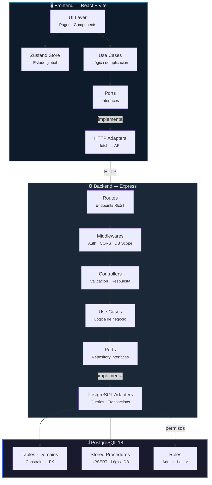
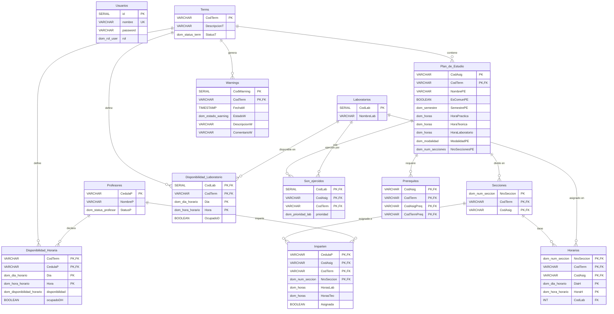
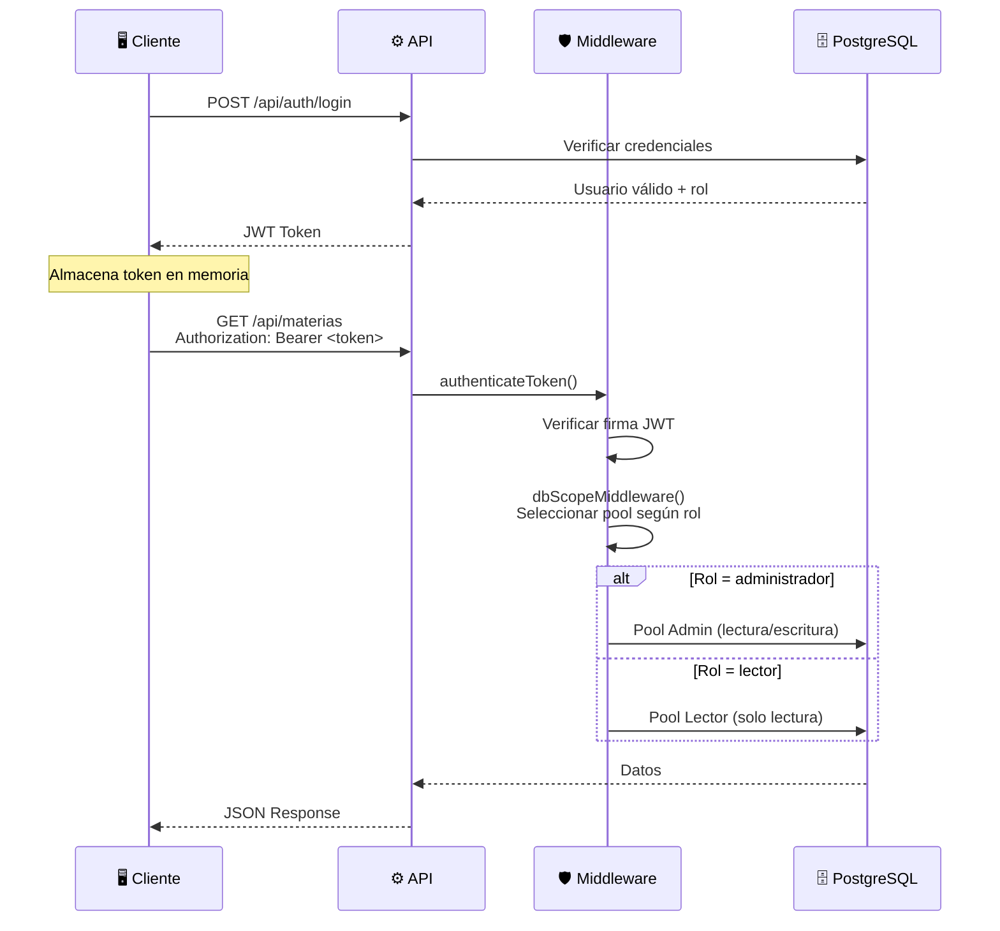

<div align="center">

# 🎓 Sistema de Gestión de Horarios

### Escuela de Informática — UCAB

[](https://nodejs.org/)
[](https://react.dev/)
[](https://expressjs.com/)
[](https://www.postgresql.org/)
[](https://www.typescriptlang.org/)
[](https://tailwindcss.com/)
[](https://docs.docker.com/compose/)
[](https://pnpm.io/)

---

**Plataforma integral para la planificación, asignación y gestión de horarios académicos** de la Escuela de Informática. Permite administrar materias, profesores, laboratorios, secciones y horarios dentro de periodos académicos (terms), con un sistema de alertas inteligente y control de acceso basado en roles.

[Comenzar](#-inicio-rápido) · [Arquitectura](#-arquitectura) · [API](#-endpoints-de-la-api) · [Base de Datos](#-modelo-de-datos)

</div>

---

## 📋 Tabla de Contenidos

- [Características Principales](#-características-principales)
- [Stack Tecnológico](#-stack-tecnológico)
- [Arquitectura](#-arquitectura)
- [Modelo de Datos](#-modelo-de-datos)
- [Requisitos Previos](#-requisitos-previos)
- [Inicio Rápido](#-inicio-rápido)
- [Scripts Disponibles](#-scripts-disponibles)
- [Estructura del Proyecto](#-estructura-del-proyecto)
- [Endpoints de la API](#-endpoints-de-la-api)
- [Variables de Entorno](#-variables-de-entorno)
- [Seguridad](#-seguridad)
- [Contribución](#-contribución)
- [Licencia](#-licencia)

---

## ✨ Características Principales

<table>
<tr>
<td width="50%">

### 📚 Gestión Académica
- **Plan de Estudio** — CRUD completo de materias con horas teóricas, prácticas y de laboratorio
- **Profesores** — Registro, disponibilidad horaria y asignación de materias
- **Laboratorios** — Control de espacios físicos con disponibilidad semanal
- **Secciones** — Creación y gestión de secciones por materia

</td>
<td width="50%">

### 🗓️ Planificación de Horarios
- **Horario visual** — Vista semanal interactiva con drag-and-drop
- **Detección de conflictos** — Sistema de alertas para choques de horarios
- **Exportación** — Generación de reportes en PDF y Excel
- **Periodos académicos (Terms)** — Gestión multi-periodo con carga masiva desde Excel

</td>
</tr>
<tr>
<td width="50%">

### 🔐 Seguridad y Roles
- **Autenticación JWT** — Tokens seguros con expiración configurable
- **Roles PostgreSQL** — `administrador` (lectura/escritura) y `lector` (solo lectura)
- **Gestión de usuarios** — Panel administrativo para CRUD de cuentas
- **CORS configurable** — Orígenes permitidos vía variables de entorno

</td>
<td width="50%">

### ⚠️ Sistema de Alertas
- **Warnings inteligentes** — Detección automática de conflictos
- **Estados de alerta** — Pendiente, Ignorado y Resuelto
- **Comentarios** — Notas de resolución por alerta
- **Filtrado por term** — Alertas contextualizadas al periodo activo

</td>
</tr>
</table>

---

## 🛠️ Stack Tecnológico

<table>
<tr>
<th align="center">Capa</th>
<th align="center">Tecnología</th>
<th align="center">Propósito</th>
</tr>
<tr>
<td><strong>Frontend</strong></td>
<td>React 19 · Vite 8 · Tailwind CSS 4 · HeroUI</td>
<td>SPA reactiva con componentes accesibles y diseño responsive</td>
</tr>
<tr>
<td><strong>Backend</strong></td>
<td>Express 5 · TypeScript 6 · tsx</td>
<td>API REST con validación y middleware de autenticación</td>
</tr>
<tr>
<td><strong>Base de Datos</strong></td>
<td>PostgreSQL 18 · Docker Compose</td>
<td>Persistencia relacional con dominios, constraints y stored procedures</td>
</tr>
<tr>
<td><strong>Estado</strong></td>
<td>Zustand 5</td>
<td>Store global ligero para estado de sesión y term activo</td>
</tr>
<tr>
<td><strong>Exportación</strong></td>
<td>jsPDF · xlsx-js-style</td>
<td>Generación de reportes en PDF y Excel con estilos</td>
</tr>
<tr>
<td><strong>Monorepo</strong></td>
<td>pnpm Workspaces</td>
<td>Gestión unificada de dependencias con versionado exacto</td>
</tr>
</table>

---

## 🏗️ Arquitectura

El proyecto implementa **Arquitectura Hexagonal (Ports & Adapters)** en ambos paquetes, garantizando separación de responsabilidades, inversión de dependencias y alta testabilidad.



### Capas por Paquete

| Capa | `backend/` | `frontend/` |
|------|-----------|-------------|
| **Dominio** | `src/domain/` — Entidades y tipos | `src/core/domain/` — Interfaces de dominio |
| **Aplicación** | `src/application/ports/` — Contratos<br/>`src/application/useCases/` — Lógica | `src/core/application/ports/` — Contratos<br/>`src/core/application/useCases/` — Lógica |
| **Infraestructura** | `src/infrastructure/database/` — PostgreSQL<br/>`src/infrastructure/http/` — Express<br/>`src/infrastructure/security/` — JWT | `src/core/infrastructure/adapters/` — HTTP |
| **UI** | — | `src/ui/pages/` — Páginas<br/>`src/ui/components/` — Componentes<br/>`src/ui/layout/` — Shell de navegación |

---

## 🗃️ Modelo de Datos

El esquema relacional cuenta con **13 tablas**, **12 dominios personalizados**, **stored procedures** y un sistema de **roles a nivel de base de datos**.



### Dominios Personalizados

| Dominio | Tipo Base | Restricción |
|---------|-----------|-------------|
| `dom_rol_user` | `VARCHAR(20)` | `'administrador'` · `'lector'` |
| `dom_semestre` | `SMALLINT` | `1 – 12` |
| `dom_modalidad` | `VARCHAR(3)` | `'PRE'` · `'VIT'` |
| `dom_status_term` | `VARCHAR(1)` | `'A'` (Activo) · `'D'` (Desactivado) |
| `dom_horas` | `SMALLINT` | `≥ 0` |
| `dom_num_secciones` | `SMALLINT` | `1 – 20` |
| `dom_status_profesor` | `VARCHAR(2)` | `'A'` · `'ER'` · `'R'` |
| `dom_estado_warning` | `VARCHAR(1)` | `'I'` · `'P'` · `'R'` |
| `dom_dia_horario` | `VARCHAR(10)` | Lunes – Domingo |
| `dom_hora_horario` | `VARCHAR(2)` | `'7'` – `'22'` |
| `dom_prioridad_lab` | `SMALLINT` | `1` · `2` |
| `dom_disponibilidad_horario` | `SMALLINT` | `0` · `1` · `2` |

---

## 📦 Requisitos Previos

| Herramienta | Versión Mínima | Instalación |
|-------------|----------------|-------------|
| **Node.js** | LTS (≥ 20) | [nodejs.org](https://nodejs.org/) |
| **pnpm** | 10.x | `npm install -g pnpm` |
| **Docker** | 24.x | [docker.com](https://docs.docker.com/get-docker/) |
| **Docker Compose** | v2 | Incluido con Docker Desktop |

---

## 🚀 Inicio Rápido

```bash
# 1 · Clonar el repositorio
git clone https://github.com/JPol0/Proyect-BD-HorarioEscuelaInfo.git
cd Proyect-BD-HorarioEscuelaInfo

# 2 · Configurar variables de entorno
cp .env.example .env          # Bash / macOS / Linux
# Copy-Item .env.example .env   # PowerShell (Windows)

# 3 · Instalar dependencias
pnpm install

# 4 · Levantar PostgreSQL en Docker
pnpm db:up

# 5 · Iniciar frontend y backend en modo desarrollo
pnpm dev
```

> [!TIP]
> Al levantar la base de datos por primera vez, Docker ejecutará automáticamente los scripts SQL en `database/` en orden alfabético:
> `01-schema.sql` → `02-roles.sql` → `03-StoreProcedure.sql` → `04-seed.sql`

Una vez iniciado:

| Servicio | URL |
|----------|-----|
| 🌐 **Frontend** | `http://localhost:5173` |
| ⚙️ **Backend API** | `http://localhost:3000` |
| 🏥 **Health Check** | `http://localhost:3000/health` |

---

## 📜 Scripts Disponibles

Todos los scripts se ejecutan desde la **raíz del monorepo**.

| Comando | Descripción |
|---------|-------------|
| `pnpm dev` | Inicia frontend (Vite) y backend (tsx watch) simultáneamente |
| `pnpm build` | Compila ambos paquetes para producción |
| `pnpm lint` | Ejecuta ESLint en todos los paquetes |
| `pnpm lint:fix` | Ejecuta ESLint con corrección automática |
| `pnpm db:up` | Levanta el contenedor PostgreSQL en modo detached |
| `pnpm db:down` | Detiene el contenedor sin eliminar datos |
| `pnpm db:downAll` | Detiene el contenedor **y elimina volúmenes** (⚠️ borra datos) |
| `pnpm db:logs` | Muestra y sigue los logs de PostgreSQL |

<details>
<summary><strong>Scripts específicos por paquete</strong></summary>

#### Frontend
```bash
pnpm --filter frontend dev       # Servidor de desarrollo Vite
pnpm --filter frontend build     # tsc -b && vite build
pnpm --filter frontend preview   # Sirve el build de producción
pnpm --filter frontend lint      # ESLint (.ts, .tsx)
```

#### Backend
```bash
pnpm --filter backend dev        # tsx watch con hot-reload
pnpm --filter backend build      # Compila TypeScript a dist/
pnpm --filter backend start      # Ejecuta node dist/server.js
pnpm --filter backend lint       # ESLint (.ts)
```

</details>

---

## 📂 Estructura del Proyecto

```
📦 Proyect-BD-HorarioEscuelaInfo/
├── 🐳 docker-compose.yml             # Servicio PostgreSQL
├── 📋 package.json                    # Scripts raíz del monorepo
├── 📋 pnpm-workspace.yaml            # Definición de workspaces
├── 🔒 .env.example                   # Template de variables de entorno
│
├── 🗄️ database/
│   ├── 01-schema.sql                  # DDL — Tablas y dominios
│   ├── 02-roles.sql                   # Roles PostgreSQL (admin/lector)
│   ├── 03-StoreProcedure.sql          # Procedimientos almacenados
│   └── 04-seed.sql                    # Datos de prueba iniciales
│
├── ⚙️ backend/
│   └── src/
│       ├── domain/                    # 🟢 Entidades del negocio
│       │   ├── Materia.ts
│       │   ├── Profesor.ts
│       │   ├── Laboratorio.ts
│       │   ├── Horario.ts
│       │   ├── Term.ts
│       │   └── ...
│       ├── application/
│       │   ├── ports/                 # 🔵 Interfaces (contratos)
│       │   │   ├── MateriaRepository.ts
│       │   │   ├── TransactionManager.ts
│       │   │   └── ...
│       │   └── useCases/              # 🔵 Lógica de aplicación
│       └── infrastructure/
│           ├── database/postgre/      # 🟠 Adaptadores PostgreSQL
│           │   ├── PgMateriaRepository.ts
│           │   ├── PgTransactionManager.ts
│           │   └── ...
│           ├── http/                  # 🟠 Capa HTTP
│           │   ├── routes/            #     13 módulos de rutas
│           │   ├── controllers/       #     Controladores
│           │   ├── middlewares/       #     Auth · CORS · DB Scope
│           │   └── apiRouter.ts       #     Router principal
│           └── security/              # 🟠 JWT Token Service
│
└── 🖥️ frontend/
    └── src/
        ├── core/
        │   ├── domain/                # 🟢 Interfaces TypeScript
        │   ├── application/
        │   │   ├── ports/             # 🔵 Contratos de repositorios
        │   │   └── useCases/          # 🔵 Casos de uso del cliente
        │   └── infrastructure/
        │       └── adapters/          # 🟠 HTTP Adapters (fetch)
        └── ui/
            ├── layout/                # 🟣 Shell de navegación
            ├── pages/                 # 🟣 9 páginas principales
            │   ├── MateriasPage.tsx
            │   ├── ProfesoresPage.tsx
            │   ├── LaboratoriosPage.tsx
            │   ├── HorariosPage.tsx
            │   ├── AlarmCenter.tsx
            │   ├── UsuariosPage.tsx
            │   ├── TermsPage.tsx
            │   └── ...
            ├── components/            # 🟣 Componentes por módulo
            │   ├── MateriaScreen/
            │   ├── ProfesoresScreen/
            │   ├── LaboratorioScreen/
            │   ├── AlertScreen/
            │   ├── TermScreen/
            │   ├── UserScreen/
            │   ├── disponibilidad/
            │   └── common/
            └── store/                 # 🟣 Zustand stores
```

---

## 🔌 Endpoints de la API

Todos los endpoints están bajo el prefijo `/api`. Las rutas protegidas requieren un token JWT en el header `Authorization`.

| Método | Ruta | Descripción | Auth |
|--------|------|-------------|------|
| `POST` | `/api/auth/login` | Autenticación de usuarios | ❌ |
| `GET` | `/api/terms` | Listar periodos académicos | ✅ |
| `POST` | `/api/terms` | Crear nuevo term | ✅ |
| `GET` | `/api/materias` | Listar plan de estudio | ✅ |
| `POST` | `/api/materias` | Crear / actualizar materia | ✅ |
| `GET` | `/api/profesores` | Listar profesores | ✅ |
| `GET` | `/api/profesores/:id/disponibilidad` | Disponibilidad horaria del profesor | ✅ |
| `GET` | `/api/laboratorios` | Listar laboratorios | ✅ |
| `POST` | `/api/laboratorios` | Crear laboratorio | ✅ |
| `GET` | `/api/laboratorios/:id/disponibilidad` | Disponibilidad del laboratorio | ✅ |
| `GET` | `/api/weekly-schedule` | Obtener horario semanal | ✅ |
| `GET` | `/api/alerts` | Listar alertas/warnings | ✅ |
| `PATCH` | `/api/alerts/:id` | Actualizar estado de alerta | ✅ |
| `GET` | `/api/users` | Listar usuarios | ✅ |
| `POST` | `/api/users` | Crear usuario | ✅ |
| `GET` | `/api/secciones` | Listar secciones | ✅ |
| `GET` | `/api/relacion-imparte` | Relaciones profesor ↔ sección | ✅ |
| `GET` | `/api/relacion-son-ejercidos` | Relaciones laboratorio ↔ materia | ✅ |
| `GET` | `/api/prerequitos` | Listar prerrequisitos | ✅ |
| `GET` | `/health` | Health check del servidor | ❌ |

---

## 🔐 Variables de Entorno

Copia `.env.example` a `.env` y configura según tu entorno:

```env
# ── Base de Datos (Docker) ──────────────────────
DB_USER=usuario_desarrollo
DB_PASSWORD=contrasena_segura_local
DB_NAME=nombre_proyecto_local
DB_PORT=5432

# ── Conexiones por Rol ──────────────────────────
DB_ADMIN_USER=backend_admin
DB_ADMIN_PASSWORD=tu_password_admin
DB_LECTOR_USER=backend_lector
DB_LECTOR_PASSWORD=tu_password_lector

# ── Seguridad ───────────────────────────────────
JWT_SECRET=tu_clave_secreta_super_segura

# ── CORS ────────────────────────────────────────
ALLOWED_ORIGINS=http://localhost:5173

# ── Nube (Opcional) ─────────────────────────────
DB_HOST=localhost
DB_SSL=true
```

---

## 🔒 Seguridad



### Características de Seguridad

- 🔑 **JWT con expiración** — Tokens firmados con `HS256`
- 🛡️ **Roles a nivel de PostgreSQL** — Las restricciones se aplican en la base de datos, no solo en el backend
- 🚫 **`x-powered-by` deshabilitado** — No se revela el framework del servidor
- 🌐 **CORS granular** — Solo dominios explícitamente permitidos
- 🔄 **DB Scope Middleware** — Selección automática de pool de conexión según el rol del usuario autenticado

---

## 🤝 Contribución

1. Haz un **fork** del repositorio
2. Crea una rama para tu feature: `git checkout -b feature/mi-feature`
3. Asegúrate de que el linter pase: `pnpm lint`
4. Haz commit de tus cambios: `git commit -m 'feat: descripción del cambio'`
5. Push a tu rama: `git push origin feature/mi-feature`
6. Abre un **Pull Request**

> [!IMPORTANT]
> Asegúrate de que `pnpm lint` pase sin errores antes de enviar tu PR.

---

## 📄 Licencia

Este proyecto es de uso académico, desarrollado como proyecto de la materia **Bases de Datos** en la [UCAB](https://www.ucab.edu.ve/).

---

<div align="center">

**Hecho con ❤️ por el equipo de Bases de Datos — Escuela de Informática UCAB**

[](https://www.typescriptlang.org/)
[](https://react.dev/)
[](https://www.postgresql.org/)

</div>
